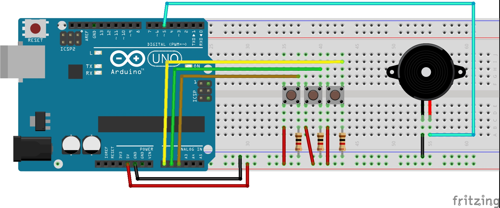

# Nave-ceu
Example using pico-Céu and Céu-Arduino

[Video](https://youtu.be/W1SWoqYCfWs)

## Circuit

### Ports
| Port    | Uno | In/Out | Description     | Correspondent on the PC keyboard |
|---------|-----|--------|-----------------|----------------------------------|
| PCINT8  | A0  | In     | Shoot Button    | SPACE                            |
| PCINT9  | A1  | In     | Right Button    | Right arrow                      |
| PCINT10 | A2  | In     | Left Button     | Left arrow                       |
| -       | ~5  | Out    | Buzzer          | -                                |
